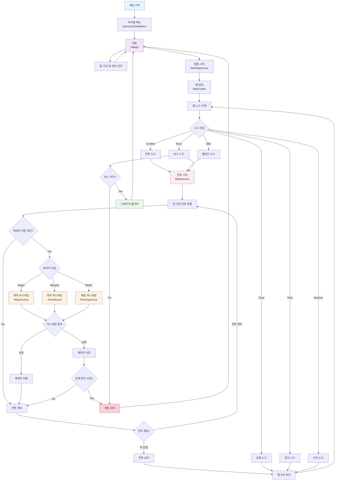

# 살놈살 게임 플로우 다이어그램

## 게임 흐름 설명

### 1. 시작 단계
- **타이틀 메뉴**: 게임 시작점
- **마을 (Village)**: 메인 허브, 캐릭터 관리 및 장비 교체

### 2. 탐험 준비
- **팀 구성**: 최대 3명의 캐릭터로 팀 구성
- **장비 관리**: 무기, 방어구 장착 및 스탯 관리

### 3. 맵 탐험
- **맵 생성**: 절차적으로 생성되는 맵
- **노드 선택**: 6가지 타입의 노드 중 선택
  - Combat: 일반 전투
  - Elite: 엘리트 몬스터 전투
  - Shop: 상점 (아이템 구매/판매)
  - Rest: 휴식 (체력/마나 회복)
  - Mystery: 랜덤 이벤트
  - Boss: 보스 전투

### 4. 전투 시스템
- **턴 기반 전투**: 속도 기반 턴 순서
- **스킬 시스템**: 각 캐릭터별 고유 스킬
- **타겟팅**: 단일/전체 타겟 스킬
- **적 AI**: 효용 기반 AI (Utility-based AI) 시스템
  - 타겟 선정: 가중치 계산 (도발+200, 저체력+10, 마법캐릭터+7 등)
  - 스킬 선택: 기본 우선도 + 조건부 보너스 점수로 최적 스킬 선택

### 5. 핵심 특징: 부활 미니게임 시스템
캐릭터가 사망 직전 상황에서 데미지 타입에 따라 미니게임 실행:
- **Magic 데미지** → 매직 미니게임 (MagicScene)
- **Ranged 데미지** → 회피 미니게임 (AvoidScene)  
- **Melee 데미지** → 패링 미니게임 (ParryingScene)

미니게임 성공 시 캐릭터 부활, 실패 시 사망

### 6. 게임 종료 조건
- **승리**: 보스 처치 시 스테이지 클리어
- **패배**: 전체 파티 사망 시 게임 오버 → 마을로 복귀

### 7. 기술적 특징
- **Additive Scene Loading**: 전투 중 미니게임 씬을 추가적으로 로드
- **상태 보존**: 전투 상태를 유지하면서 미니게임 진행
- **씬 전환**: 미니게임 완료 후 원활한 전투 복귀
- **효용 기반 AI**: 타겟 선정과 스킬 선택 모두 효용값 계산으로 최적 행동 결정